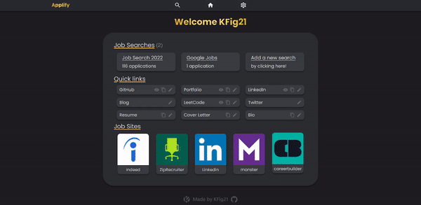

# Applify

<a href="https://kfig21.github.io/applify_client/#/" target="_blank" rel="noopener noreferrer">View the project here!</a> 👀

Applify API repo - <a href="https://github.com/KFig21/applify_api" target="_blank" rel="noopener noreferrer">click here!</a>

<h3>Summary</h3>

While on my job search I decided to build a web app that would assist me in the process. Applify is built with the MERN stack, React sticky-tables, Styled-components, and JWT authentication. The goal of this project is to help simplify and streamline the job search process by allowing users to track their applications and store their credentials in easily accessible quick-links.

 <h3>Technologies:</h3>
  <ul>
  <li><strong>M</strong>ongoDB</li>
  <li><strong>E</strong>xpressJS</li>
  <li><strong>R</strong>eactJS</li>
  <li><strong>N</strong>odeJS</li>
  <li>Redux</li>
  <li>Styled Components</li>
  <li>JWT Authentication</li>
  <li>React Sticky-Table</li>
  <li>Heroku hosting</li>   
  <li>SASS</li>
  <li>Selenium</li>
 </ul>

 <h3>Features:</h3>
 <ul>
  <li>Responsive Design</li>
  <li>Create a profile or use the test account. Signup/Login/Logout authentication using JSON web token.</li>
  <li>Users are allowed to have up to 10 different job searches.</li>
  <li>Each Job search can hold up to 999 applications/listings.</li>
  <li>Add new applications, view application details, update job applications.</li>
  <li>Job application table uses sticky headers and columns. The table can be filtered and sorted.</li>
  <li>The Job table uses pagination that can be set to different limits (How many job applications appear on the table; min 20, max 100).</li>
  <li>Home page offers 9 quick-links that allows the user to save important application info that can be quickly copied such as:</li>
    <ul>
      <li>GitHub profile link</li>
      <li>Portfolio link</li>
      <li>LinkedIn link</li>
      <li>Cover Letter text</li>
      <li>Resume text</li>
    </ul>
  <li>The quick-links can be re-named and switched between link/text types.</li>
  <li>Styled components used to create multiple themes.</li>
  <li>Scrape listing info from LinkedIn/Indeed URLs.</li>
 </ul>

 <h3>Demo GIF</h3>

---

<h3>Thanks for checking out my project! Any && all feedback is appreciated!</h3>
